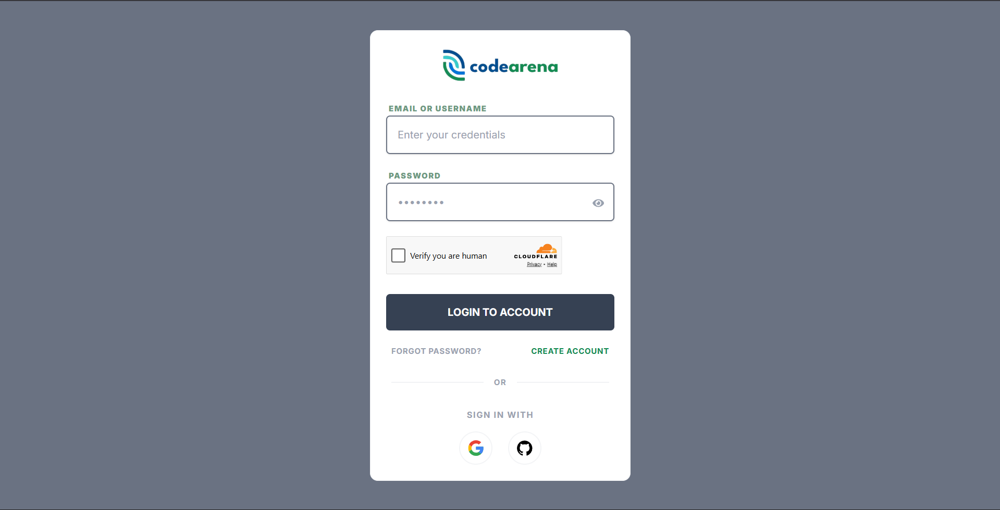
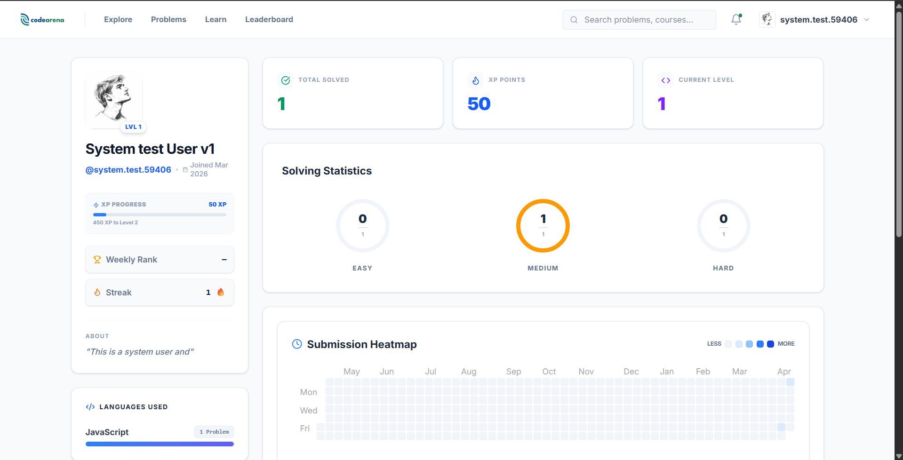
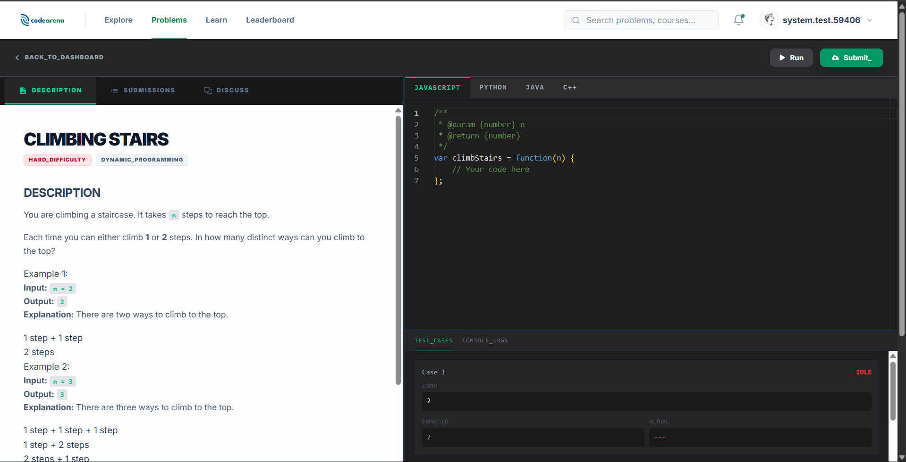

# CodeArena

CodeArena is a web-based competitive programming and learning platform designed to help users improve their coding skills through problem solving, challenges, and structured learning resources.

The system provides features such as user registration, login, problem submission with real-time code execution, challenge participation, course management, leaderboards, and a creator studio for publishing learning content.

---

## Project Objective

The main objective of this project is to develop a full-stack platform that enables users to practice programming problems, compete in challenges, track their progress through gamification, and access curated learning resources — all through a simple and efficient interface.

---

## Features

The system provides the following features:

- User registration and OAuth login (Google, GitHub)
- User login and JWT-based authentication
- Dashboard for users with XP, level, and streak tracking
- Problem solving with real-time code execution via Judge0
- Challenge participation with bonus XP rewards
- Search functionality across problems, courses, and challenges
- Creator studio for publishing video, PDF, and article resources
- Admin panel for user, problem, and content moderation
- Notification system for badges, level-ups, and achievements
- Leaderboard and gamification (XP, levels, badges, streaks)
- Secure logout system

---

## Technologies Used

### Frontend

- React 19 (Next.js 16)
- TypeScript
- Tailwind CSS
- Redux Toolkit + Redux Persist
- TanStack React Query
- Monaco Editor (code editor)

### Backend

- Node.js with Express 5
- TypeScript
- Passport.js (Google & GitHub OAuth)
- JWT (access + refresh token strategy)
- Nodemailer (email)
- Cloudinary (media uploads)
- Judge0 API (code execution)

### Database

- PostgreSQL
- Prisma ORM

### Deployment

- Frontend: Vercel
- Backend: Render
- Database: Neon

---

## System Requirements

### Hardware

- Computer or smartphone
- Internet connection

### Software

- Web browser such as Google Chrome or Firefox
- Node.js v18 or higher
- PostgreSQL database

---

## Installation and Setup

Steps to run the project locally.

### 1. Clone the repository

```bash
git clone https://github.com/Anuj-Sapkota/anuj-sapkota-codearena.git
```

### 2. Go to the project folder

```bash
cd anuj-sapkota-codearena
```

### 3. Set up environment variables

Copy the example env files and fill in your values:

```bash
cp backend/.env.example backend/.env
cp frontend/.env.example frontend/.env
```

### 4. Install dependencies

**Backend:**

```bash
cd backend
npm install
```

**Frontend:**

```bash
cd frontend
npm install
```

### 5. Set up the database

```bash
cd backend
npx prisma migrate dev
npx prisma generate
```

### 6. Run the application

**Backend:**

```bash
cd backend
npm run dev
```

**Frontend:**

```bash
cd frontend
npm run dev
```

The frontend will be available at `http://localhost:3000` and the backend at `http://localhost:5000`.

---

## Live Project

Live URL of the deployed system:

```
https://codearena-frontend-ivory.vercel.app/
```

---

## Project Structure

```
anuj-sapkota-codearena/
│
├── frontend/               # Next.js frontend application
│   ├── app/                # App router pages
│   ├── components/         # Reusable UI components
│   ├── lib/                # Store, services, utilities
│   └── public/             # Static assets
│
├── backend/                # Express backend API
│   ├── src/
│   │   ├── controllers/    # Route handlers
│   │   ├── services/       # Business logic
│   │   ├── middleware/      # Auth, error handling
│   │   ├── routes/         # API route definitions
│   │   └── utils/          # Helpers and utilities
│   └── prisma/             # Database schema and migrations
│
└── README.md
```

---

## Screenshots

**Login page**


**User dashboard**


**Problem solving workspace**


---

## Future Improvements

Possible improvements for the system:

- Mobile application version
- Real-time multiplayer coding battles
- Improved user interface and accessibility
- AI-powered code hints and explanations
- More advanced analytics for creators
- Additional security features (2FA)
- Discussion forums per problem

---

## Authors

- **Student Name**: Anuj Sapkota
- **Program / Department**: Bsc (Hons) Computing
- **University / College Name**: Itahari International College

---

## License

This project is created for educational purposes as part of a Final Year Project.
